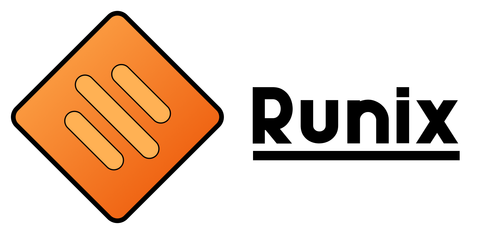

---

Runix is an experimental realtime UNIX-like OS written in the Rust programming language.  
It is under development, and is obviously not yet suitable for any kind of serious use.

## :question: What does "Runix" stand for?

It actually stands for two things!

- **R**ealtime **Unix**
- **Ru**st **Unix**

## :package: Building

Building can be done in Windows and macOS, but the makefile expects Linux to be able to generate an ISO.  
Thus, using Linux is recommended. Windows users may use WSL without a hitch.

1. Install **Rust**, **GNU Make**, and your distro's **build essentials**.
2. Execute `rustup target add x86_64-unknown-none`. This will download the required toolchain.
3. Run `make all` and wait for it to finish. It may take a while on the first build.

## :handshake: Contributing

Runix is open to pull requests and issue tickets! Any help is appreciated.  
A contribution guide will be added later into development.

# :balance_scale: License
This project is licensed under the **Apache License 2.0** which you can read [here](LICENSE).  
